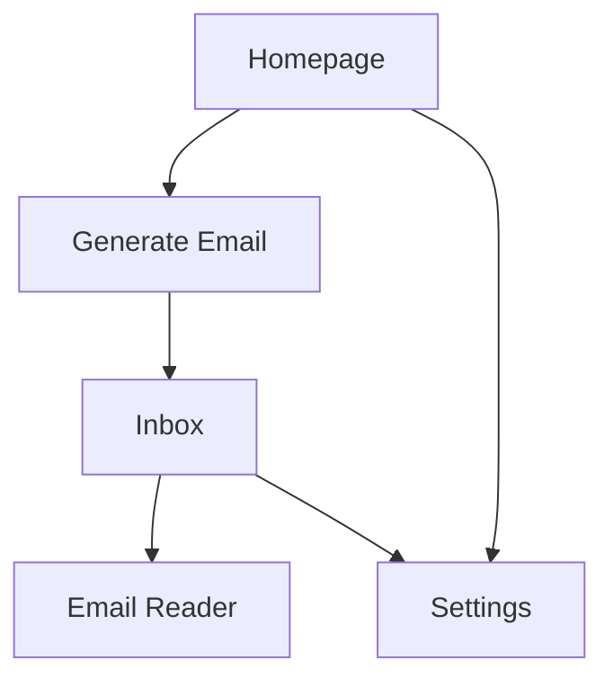

# PRD Frontend - Aplikasi Tempmail

## 1. Product Overview

Aplikasi tempmail frontend dengan arsitektur komponen terstruktur (navbar, sidebar, footer terpisah) yang menampilkan design premium modern, clean, dan minimalis untuk pengalaman pengguna yang optimal.

Target: Memberikan interface yang profesional dan mudah digunakan untuk layanan email sementara dengan fokus pada kesederhanaan dan efisiensi.

## 2. Core Features

### 2.1 UI Framework

**Shadcn UI Components (Full Implementation):**

* Tidak menggunakan next-themes atau dark mode

* Light theme only dengan design system Shadcn yang konsisten

* Komponen utama: Button, Card, Input, Dialog, Sheet, Sidebar, Navigation Menu, Table, Form, Select, Checkbox, Switch, Tabs, Alert, Badge, Progress, Skeleton, Tooltip, Dropdown Menu, Command, Scroll Area

### 2.2 Feature Module

Aplicasi frontend tempmail terdiri dari halaman-halaman utama berikut:

1. **Homepage**: hero section, email generator, feature highlights
2. **Inbox**: email list dengan virtualization, email reader
3. **Settings**: konfigurasi akun, preferensi notifikasi

### 2.3 Page Details

| Page Name | Module Name        | Feature Description                                 | Shadcn Components                 |
| --------- | ------------------ | --------------------------------------------------- | --------------------------------- |
| Homepage  | Hero Section       | Display value proposition dengan CTA generate email | Button, Card, Badge               |
| Homepage  | Email Generator    | Generate temporary email dengan copy button         | Input, Button, Card, Alert        |
| Homepage  | Feature Highlights | Showcase fitur utama dalam card grid layout         | Card, Badge                       |
| Inbox     | Email List         | Virtualized list email dengan preview dan status    | Table, Card, Badge, Skeleton      |
| Inbox     | Email Reader       | Detail email dengan attachment support              | Card, Button, Dialog, Scroll Area |
| Settings  | Account Config     | Form pengaturan akun dengan validation              | Card, Input, Button, Form, Select |
| Settings  | Notification Prefs | Toggle notifikasi dan preferensi alert              | Card, Switch, Checkbox, Button    |

## 3. Core Process

**User Flow Utama:**

1. User mengakses homepage → generate email sementara
2. User copy email → gunakan untuk registrasi/verifikasi
3. User check inbox → baca email masuk
4. User manage settings → kustomisasi preferensi



## 4. User Interface Design

### 4.1 Design Style (Shadcn UI System)

* **Theme**: Light theme only (no dark mode, no next-themes)

* **Color Palette**: Shadcn default color system dengan CSS variables

  * Primary: hsl(222.2 84% 4.9%) - untuk teks utama

  * Secondary: hsl(210 40% 96%) - untuk background secondary

  * Accent: hsl(210 40% 98%) - untuk accent elements

  * Muted: hsl(210 40% 96%) - untuk muted backgrounds

  * Border: hsl(214.3 31.8% 91.4%) - untuk borders

* **Typography**: Inter font family via Shadcn, consistent text sizing

* **Components**: Full Shadcn UI component library

* **Icons**: Lucide React icons (integrated dengan Shadcn)

* **Spacing**: Tailwind spacing scale (4px base unit)

### 4.2 Page Design Overview (Shadcn Components)

| Page Name | Module Name     | Shadcn UI Elements                                                  |
| --------- | --------------- | ------------------------------------------------------------------- |
| Homepage  | Hero Section    | Card wrapper, Button (primary variant), Badge untuk highlights      |
| Homepage  | Email Generator | Input dengan label, Button (default + outline), Alert untuk status  |
| Homepage  | Feature Grid    | Card grid layout, Badge untuk categories                            |
| Inbox     | Email List      | Table component, Badge untuk status, Skeleton untuk loading         |
| Inbox     | Email Reader    | Card untuk content, Dialog untuk attachments, Button actions        |
| Settings  | Form Cards      | Card containers, Form components, Switch/Checkbox, Select dropdowns |

### 4.3 Layout Structure (Shadcn Components)

**Desktop Layout:**

* **Navbar**: Navigation Menu component, Button untuk user menu

* **Sidebar**: Sidebar component (Shadcn), collapsible dengan Sheet behavior

* **Main Content**: Container dengan proper spacing, Card-based layout

* **Footer**: Simple layout dengan Button links

**Mobile Layout:**

* **Navbar**: Navigation Menu (mobile variant), Sheet untuk hamburger

* **Sidebar**: Sheet component untuk slide-out drawer

* **Main Content**: Full-width responsive, Card stacking

* **Footer**: Responsive Button layout

### 4.4 Shadcn Component Specifications

**Navigation Menu (Navbar):**

* Shadcn Navigation Menu component

* Button components untuk user actions

* Dropdown Menu untuk user menu

* Badge untuk notifications

**Sidebar Component:**

* Shadcn Sidebar component (built-in collapsible)

* Navigation items dengan Button variants

* Sheet component untuk mobile overlay

* Badge untuk status indicators

**Card System:**

* Shadcn Card component (Header, Content, Footer)

* Consistent padding dan spacing

* Built-in hover states dan shadows

* Responsive behavior

**Form Components:**

* Shadcn Form dengan validation

* Input, Select, Checkbox, Switch components

* Label dan error handling

* Button untuk form actions

**Data Display:**

* Table component untuk email lists

* Dialog untuk modals dan overlays

* Alert untuk notifications

* Progress untuk loading states

### 4.5 Responsiveness

**Breakpoints:**

* Mobile: < 768px

* Tablet: 768px - 1024px

* Desktop: > 1024px

**Mobile Optimizations:**

* Touch targets minimum 44px

* Sidebar converts to drawer

* Navigation becomes hamburger menu

* Cards stack vertically

* Font sizes scale appropriately

* Spacing reduces for compact layout

**Interaction States:**

* Hover: Subtle color changes, shadow elevation

* Focus: Blue outline ring for accessibility

* Active: Pressed state with slight scale

* Loading: Skeleton placeholders, spinner indicators

* Error: Red border, error message display

### 4.6 Accessibility (Shadcn Built-in)

* WCAG 2.1 AA compliance (built into Shadcn components)

* Keyboard navigation support (native Shadcn behavior)

* Screen reader compatibility (aria labels included)

* Focus indicators (Shadcn focus ring system)

* Semantic HTML structure (Shadcn best practices)

* No dark mode complexity - light theme accessibility optimized

### 4.7 Technical Implementation

**Framework & Core Technologies:**

* **Next.js 15** (App Router, Server Components, Streaming)

* **Tailwind CSS v4** (@theme syntax, CSS-first configuration)

* **React 19** (dengan Next.js 15 compatibility)

* **TypeScript 5.x** (strict mode)

**Required Dependencies:**

* @radix-ui/\* (Shadcn foundation)

* class-variance-authority (component variants)

* clsx + tailwind-merge (className utilities)

* lucide-react (icons)

* react-hook-form (form handling)

* zod (validation)

* sonner (toast notifications)

**No Dark Mode Dependencies:**

* ❌ next-themes (tidak digunakan)

* ❌ Dark mode toggles

* ❌ Theme switching logic

* ✅ Light theme only dengan Shadcn consistency

## 5. Next.js 15 Implementation

### 5.1 App Router Architecture

**File Structure:**

```
app/
├── layout.tsx          # Root layout dengan metadata
├── page.tsx           # Homepage
├── inbox/
│   ├── layout.tsx     # Inbox layout
│   ├── page.tsx       # Email list
│   └── [id]/
│       └── page.tsx   # Email detail
├── settings/
│   ├── layout.tsx     # Settings layout
│   └── page.tsx       # Settings form
└── globals.css        # Tailwind v4 styles
```

### 5.2 Server Components Strategy

**Server Components (Default):**

* Layout components (Navbar, Sidebar, Footer)

* Static content rendering

* Initial data fetching

* SEO metadata generation

**Client Components ('use client'):**

* Interactive forms (email generator, settings)

* State management (email list, notifications)

* Event handlers (copy, delete, refresh)

* Real-time updates (inbox polling)

### 5.3 Streaming & Suspense

**Loading States:**

```tsx
// app/inbox/loading.tsx
export default function Loading() {
  return <EmailListSkeleton />;
}

// Suspense boundaries untuk progressive loading
<Suspense fallback={<EmailSkeleton />}>
  <EmailList />
</Suspense>
```

### 5.4 Next.js 15 Features

* **Turbopack** untuk development yang lebih cepat

* **Partial Prerendering** untuk optimasi performa

* **Enhanced caching** dengan fetch API

* **Improved error handling** dengan error boundaries

* **Better TypeScript support** dengan strict mode

## 6. Tailwind CSS v4 Implementation

### 6.1 Styling Implementation

**Tidak Menyentuh globals.css:**

* Menggunakan globals.css yang sudah ada tanpa modifikasi

* Semua styling menggunakan utility classes Tailwind CSS v4

* Komponen Shadcn UI dengan styling bawaan

* Tidak ada custom CSS atau @theme modifications

**Styling Strategy:**

* Utility-first dengan Tailwind classes

* Shadcn UI component variants

* Inline styling dengan className

* CSS-in-JS jika diperlukan untuk dynamic styles

### 6.2 Tailwind v4 Utility Usage

**Utility Classes Only:**

* Menggunakan utility classes Tailwind yang sudah tersedia

* Tidak menambah custom utilities di globals.css

* Responsive design dengan breakpoint utilities

* State variants (hover, focus, active) dengan utility modifiers

**Component Styling:**

* Shadcn UI component styling (built-in)

* Tailwind utility combinations untuk custom layouts

* Dynamic classes dengan conditional rendering

* Consistent spacing dengan Tailwind scale

### 6.3 Configuration Files

**Menggunakan Konfigurasi Existing:**

* tailwind.config.ts yang sudah ada (tidak dimodifikasi)

* postcss.config.mjs yang sudah ada (tidak dimodifikasi)

* Tidak menambah custom theme configuration

* Menggunakan default Tailwind v4 setup

**Content Configuration:**

* Scan semua file component untuk utility classes

* Purging otomatis untuk production build

* JIT compilation untuk development

### 6.4 Performance Optimizations

* **JIT compilation** untuk faster builds

* **CSS purging** untuk production

* **Critical CSS** extraction

* **Component-level** CSS splitting

## 7. Development Workflow

### 7.1 Build Process

```bash
# Development
npm run dev          # Next.js 15 dengan Turbopack

# Production
npm run build        # Optimized build
npm run start        # Production server
```

### 7.2 Code Quality

* **ESLint** dengan Next.js 15 rules

* **TypeScript strict mode**

* **Prettier** untuk code formatting

* **Husky** untuk pre-commit hooks

### 7.3 Testing Strategy

* **Jest** untuk unit testing

* **React Testing Library** untuk component testing

* **Playwright** untuk E2E testing

* **Storybook** untuk component documentation

